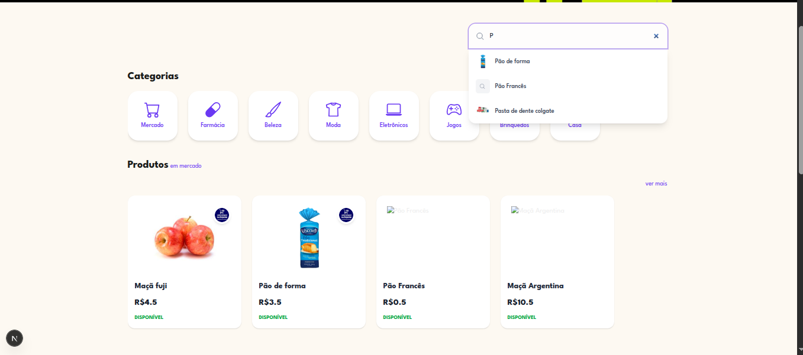
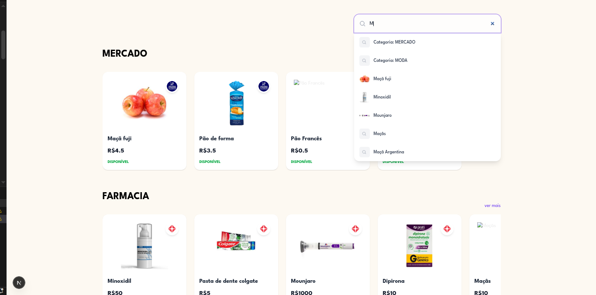
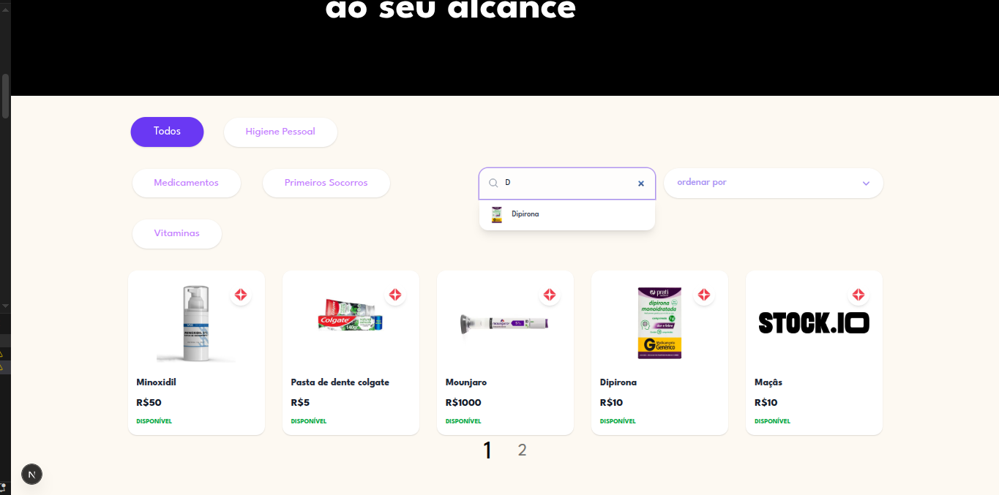

# Stock.io

Número da Lista: Grupo 2<br>
Conteúdo da Disciplina: Busca<br>

## 👥 Equipe - Grupo 2

Dupla responsavel pela implementação dos algoritmos de busca

| Foto | Nome | Matricula |
|---:|---|---|
|  | **[Giovanna Felipe](https://github.com/giovannafg)** | 241038998 |
|  | **[André Henrique](https://github.com/andrehsb)** | 241025149 |

## Sobre 
Frontend do sistema de Catalogo de produtos e ecommerce, construído com Next.js (App Router) e TypeScript. 


## Screenshots





## 🛠️ Tecnologias
| Categoria | Tecnologia |
|---|---|
| Framework | Next.js (App Router) |
| Linguagem | TypeScript |
| Estilização | Tailwind CSS |
| HTTP Client | Axios |

## 🚀 Instalação Rápida

```bash
# clonar
git clone <URL_DO_REPOSITORIO>
cd gorgonas-frontend

# instalar dependências
npm install
# ou
yarn install

#biblioteca utilizada
npm install lucide-react
```

## 🔒 Variáveis de Ambiente
Crie `.env.local` na raiz (mesmo nível do package.json):

```env
NEXT_PUBLIC_API_BASE_URL=http://localhost:3001
```


## ▶️ Scripts Úteis
```bash
npm run dev       # servidor de desenvolvimento (http://localhost:3000)

```

## Uso 
Ao acessar a aplicação, o usuário, ainda deslogado, será direcionado para a HomePage e terá acesso à todo o catálogo de produtos, categorias e lojas. 
Após efetuar o login o usuário pode navegar pelo seu perfil para adicionar uma loja, adicionar um produto e adicionar avaliações em outros produtos.

## Outros 
Link para repositório backend: https://github.com/eda2-2026/Busca_G2_back

Link para vídeo explicativo: https://youtu.be/GpyrYawFntM


## Estruturas de dados implementadas para otimização
O projeto utiliza a estrutura de **Árvore Trie** para otimizar a busca de informações. Enquanto uma busca comum em um array tem complexidade $O(n)$, a nossa implementação atinge $O(m)$, onde *m* é o comprimento do termo buscado.

### Onde as Árvores são utilizadas:

1.  **Home Page:**
    http://localhost:3000
    
2.  **Páginas de Categoria:**:http://localhost:3000/{nomeCategoria}
    
3.  **Página de Lojas**:http://localhost:3000/loja

4. **Página de Produtos**: http://localhost:3000/produtos


Em todas essas páginas a árvore de busca foi implementada na barra de pesquisa.